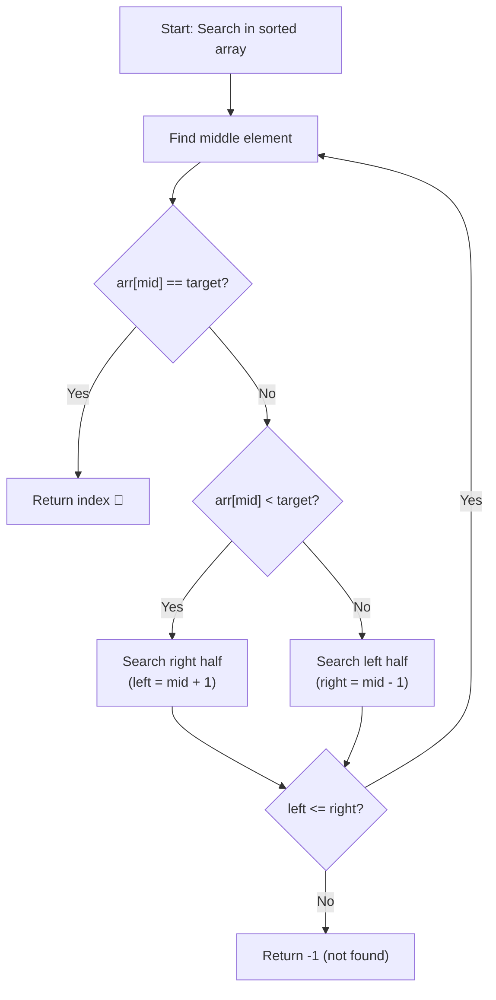
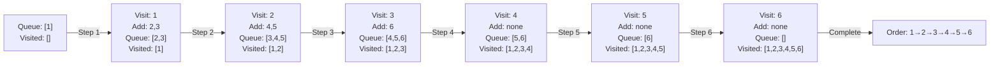
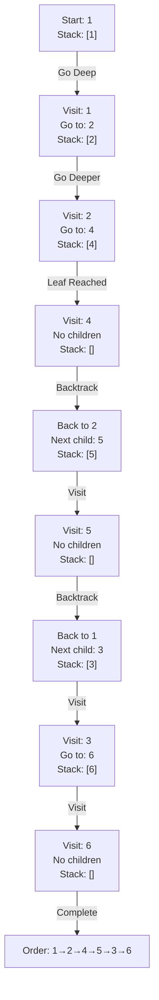
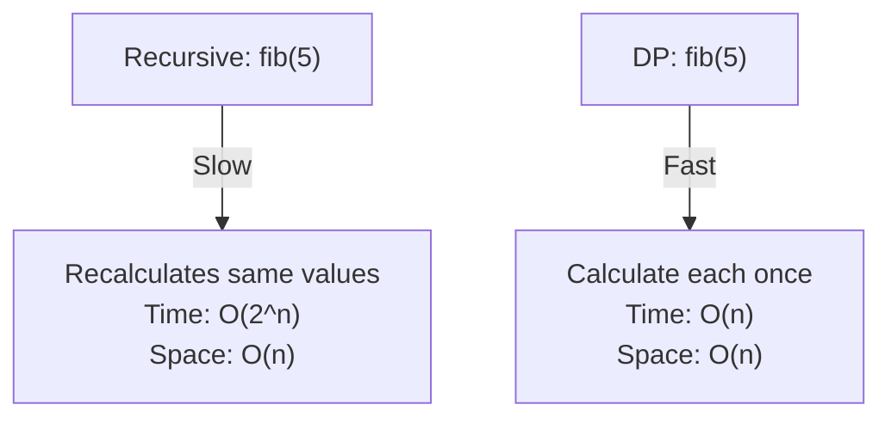
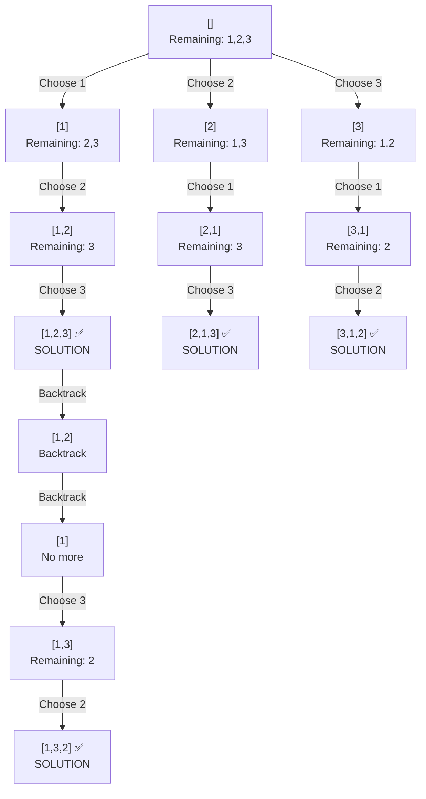

# 🎨 Visual Algorithm Flowcharts

**See algorithms in action with step-by-step Mermaid diagrams.**

---

## 1. Binary Search Execution

**Problem:** Find target in sorted array  
**Input:** `arr = [1, 3, 5, 7, 9, 11, 13]`, `target = 7`

```
Start: left=0, right=6

Step 1: Check middle (mid=3)
├─ arr[3] = 7
├─ target = 7
└─ FOUND at index 3! ✅

Time: O(log n) - halved search space in 1 step
```

**Decision Tree:**


---

## 2. BFS - Level by Level Traversal

**Problem:** Traverse graph level by level  
**Input:** Tree structure, start from node 1

```
        1
       / \
      2   3
     / \   \
    4   5   6
```

**Step-by-step execution:**



**Key insight:** All neighbors of current level processed before next level

---

## 3. DFS - Depth First Exploration

**Problem:** Traverse graph going as deep as possible  
**Input:** Same tree, start from node 1



**Contrast:** DFS explores deep, BFS explores wide

---

## 4. Dynamic Programming - Fibonacci Table Building

**Problem:** Calculate fib(5)  
**Approach:** Build table bottom-up

```
fib(n) = fib(n-1) + fib(n-2)

Step 1: Initialize
┌─────────────────────────────┐
│ n:   0  1  2  3  4  5       │
│ fib: 0  1  ?  ?  ?  ?       │
└─────────────────────────────┘

Step 2: Fill fib(2)
┌─────────────────────────────┐
│ n:   0  1  2  3  4  5       │
│ fib: 0  1  1  ?  ?  ?       │
│           ↑ (0+1)           │
└─────────────────────────────┘

Step 3: Fill fib(3)
┌─────────────────────────────┐
│ n:   0  1  2  3  4  5       │
│ fib: 0  1  1  2  ?  ?       │
│              ↑ (1+1)         │
└─────────────────────────────┘

Step 4: Fill fib(4)
┌─────────────────────────────┐
│ n:   0  1  2  3  4  5       │
│ fib: 0  1  1  2  3  ?       │
│                 ↑ (1+2)      │
└─────────────────────────────┘

Step 5: Fill fib(5)
┌─────────────────────────────┐
│ n:   0  1  2  3  4  5       │
│ fib: 0  1  1  2  3  5       │
│                    ↑ (2+3)   │
└─────────────────────────────┘

Result: 5 ✅
Time: O(n), Space: O(n)
```

**Comparison:**


---

## 5. Backtracking - Choice Tree

**Problem:** Find all permutations of [1, 2, 3]



**Result:** All 6 permutations found: [1,2,3], [1,3,2], [2,1,3], [2,3,1], [3,1,2], [3,2,1]

---

## 6. Dijkstra's Algorithm - Priority Queue Updates

**Problem:** Find shortest path from A to E

```
      2
    A---B
    |\ /|
    4 X 1
    |/ \|
    D---C
      3
```

**Step-by-step:**

```
Initial: distances = {A:0, B:∞, C:∞, D:∞, E:∞}

Step 1: Process A (distance 0)
├─ Update B: 0 + 2 = 2 ✅
├─ Update D: 0 + 4 = 4 ✅
└─ Priority Queue: [(2,B), (4,D), (∞,C), (∞,E)]

Step 2: Process B (distance 2)
├─ Update C: 2 + 1 = 3 ✅
├─ Update E: 2 + 5 = 7 ✅
└─ Priority Queue: [(3,C), (4,D), (7,E)]

Step 3: Process C (distance 3)
├─ Update D: Already 4 < 3+3=6 ✓
├─ No updates to E
└─ Priority Queue: [(4,D), (7,E)]

Step 4: Process D (distance 4)
├─ All neighbors checked
└─ Priority Queue: [(7,E)]

Step 5: Process E (distance 7)
└─ Shortest path: A→B→C→E with cost 7
```

**Key insight:** Always process smallest distance first (priority queue)

---

## 7. Union-Find - Path Compression

**Problem:** Connect elements and detect cycles

```
Union([1,2,3,4,5], operations: union(1,2), union(2,3), find(1))

Initial: Each element is own parent
1→1, 2→2, 3→3, 4→4, 5→5

Operation 1: union(1, 2)
├─ Find root of 1: 1
├─ Find root of 2: 2
└─ Connect: 1→2 (2 is now parent)
   1→2, 2→2, 3→3, 4→4, 5→5

Operation 2: union(2, 3)
├─ Find root of 2: 2
├─ Find root of 3: 3
└─ Connect: 2→3 (3 is now parent)
   1→2→3, 2→3, 3→3, 4→4, 5→5

Operation 3: find(1) - WITH PATH COMPRESSION
├─ Traverse: 1→2→3
├─ Compress: Direct 1→3
└─ Result: 3 (all same component)
   After compression: 1→3, 2→3, 3→3
```

**Benefit:** Path compression makes future lookups O(α(n)) ≈ O(1)

---

## 8. Merge Sort - Divide and Conquer

**Problem:** Sort [38, 27, 43, 3, 9]

```
Split Stage:
[38,27,43,3,9]
    ↙        ↘
 [38,27]    [43,3,9]
   ↙ ↘      ↙   ↘
[38] [27] [43] [3,9]
          ↙  ↘
        [3] [9]

Merge Stage:
[38] [27]  →  [27,38]
[43] [3] [9] → [3,9] then [3,9,43]

          ↙         ↘
    [27,38]     [3,9,43]
         ↙              ↘
       [3,9,27,38,43]  ✅

Time: O(n log n)
Space: O(n)
```

---

## 9. Two Pointers - Converging Approach

**Problem:** Find pair with sum = target  
**Input:** [1, 2, 3, 4, 5, 6], target = 7

```
Step 1:
left=0, right=5
1 + 6 = 7 ✅ FOUND!

Process:
┌────────────────────┐
│[1, 2, 3, 4, 5, 6]  │
│ ↑               ↑  │
│ L               R  │
│ Sum: 1+6=7 ✅      │
└────────────────────┘

Step 2 (if not found):
left=0, right=5
If 1+6 < 7: left++
If 1+6 > 7: right--

Example: target = 8
┌────────────────────┐
│[1, 2, 3, 4, 5, 6]  │
│ ↑               ↑  │
│ L               R  │
│ 1+6=7 < 8, left++  │
└────────────────────┘

┌────────────────────┐
│[1, 2, 3, 4, 5, 6]  │
│    ↑           ↑   │
│    L           R   │
│ 2+6=8 ✅           │
└────────────────────┘

Time: O(n)
Space: O(1)
```

---

## 10. Sliding Window - Substring Search

**Problem:** Longest substring without repeating characters  
**Input:** "abcabcbb"

```
Expand window, add characters:

Step 1: Add 'a'
Window: "a"
Char set: {a}

Step 2: Add 'b'
Window: "ab"
Char set: {a,b}

Step 3: Add 'c'
Window: "abc"
Char set: {a,b,c}

Step 4: Add 'a' - DUPLICATE!
Window: "abca" ← 'a' appears twice
├─ Shrink from left
├─ Remove 'a' at position 0
└─ Window: "bca"
Char set: {b,c,a}

Step 5: Add 'b' - DUPLICATE!
Window: "bcab" ← 'b' appears twice
├─ Shrink from left
├─ Remove 'b' at position 1
└─ Window: "cab"
Char set: {c,a,b}

Continue... Final answer: 3 characters ("abc", "bca", "cab", "cab")

Time: O(n)
Space: O(min(n, charset_size))
```

---

## 11. Topological Sort - Kahn's Algorithm

**Problem:** Order tasks by dependencies  
**Dependencies:** A→B, B→C, A→C

```
Initial: In-degree count
A: 0 (no dependencies)
B: 1 (depends on A)
C: 2 (depends on A, B)

Step 1: Process A (in-degree=0)
├─ Add A to result: [A]
├─ Remove A→B edge
├─ Reduce B's in-degree to 0
└─ Queue: [B]

Step 2: Process B (in-degree=0)
├─ Add B to result: [A,B]
├─ Remove B→C edge
├─ Reduce C's in-degree to 1
└─ Queue: []

Wait, C still has in-degree 1? Check A→C edge...
After removing A→B, also remove A→C edge
├─ Reduce C's in-degree to 0
└─ Queue: [C]

Step 3: Process C (in-degree=0)
├─ Add C to result: [A,B,C]
└─ Queue: []

Result: [A,B,C] ✅ Valid order
```

---

## 12. Quick Sort - Partition and Recursion

**Problem:** Sort [3, 1, 4, 1, 5, 9, 2, 6]

```
Select pivot: 3

Partition (< 3 go left, ≥ 3 go right):
[1, 1, 2] | 3 | [4, 5, 9, 6]
  left       pivot    right

Recursively sort left:
[1, 1] | 2 | []

Recursively sort right:
[4, 5, 6] | 9 | []

Combine:
[1, 1, 2, 3, 4, 5, 6, 9] ✅

Time: O(n log n) average, O(n²) worst
Space: O(log n) for recursion
```

---

## Complexity Comparison

```mermaid
graph LR
    A["Algorithm Type"] 
    A -->|O(n²)| B["Bubble, Insertion, Selection<br/>🐢 Slow for large n"]
    A -->|O(n log n)| C["Merge, Quick, Heap<br/>🚗 Good for most"]
    A -->|O(n)| D["Counting, Radix<br/>🚀 Very fast"]
    A -->|O(log n)| E["Binary Search<br/>⚡ Super fast"]
    A -->|O(2^n)| F["Brute Force<br/>🔥 Too slow"]
```

---

**Reference these diagrams while coding to visualize algorithm behavior!** 📊

